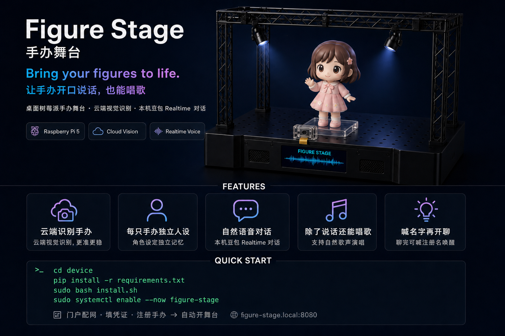
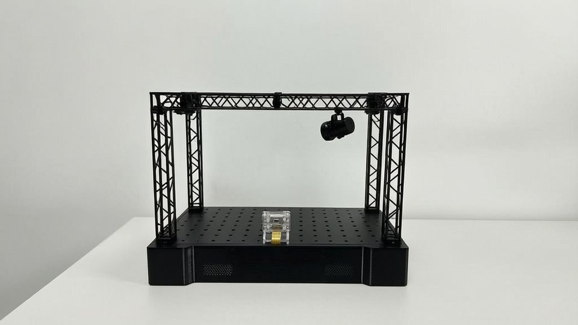
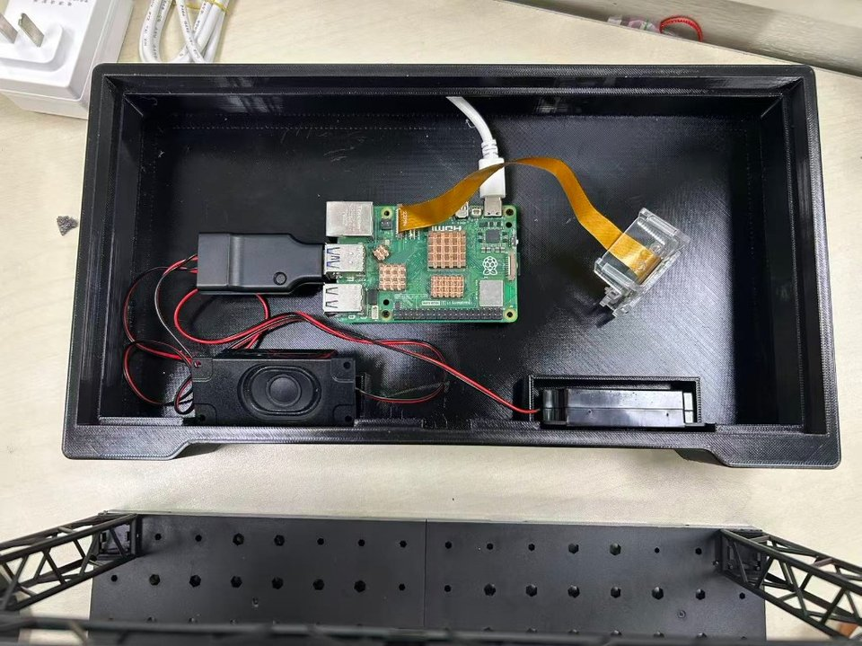

# 手办舞台 Figure Stage

  舞台摄像头识别台上手办 → 采集帧云端匹配手办注册的视觉特征 → 舞台连实时语音API手办聊天、唱歌、点咖啡（瑞幸MCP）。  
  可随时切换手办开启新聊天，聊完手办不移开时，可再唤醒手办。


<p align="center">
  
</p>

<p align="center">
  
</p>

本仓库是手办舞台设备端：复刻项目时可只部署 [`device/`](device/)目录

---

## 复刻前先读这三句

1. **请只部署 [`device/`](device/)**（拷贝该目录即可，可以不整仓 clone）； 
2. **必须有识别云**：本仓库是设备端，视觉特征在云上算。联系作者分配 `CLOUD_BASE_URL` + `DEVICE_CLOUD_TOKEN`（或可以自建云服务）。**没有云地址时，舞台无法识别手办。**  
3. **完整命令、排障、摄像头细节**在 **[`device/README.md`](device/README.md)**；下面是「从零到第一次开口」的最短路径。

---

## 你将得到什么

| 能力 | 说明 |
|------|------|
| 上台对话 | 放手办 → 云识别 → 实时语音 |
| 手机门户 | 配网 / 语音对话模型API / 注册，地址见下文 |
| 开机自启 | systemd：`figure-stage` |
| 名字唤醒 | 闲时喊台上该手办的注册名 |
| 断网配网 | 自动热点 + 提示音（仓库已含 wav） |

---

## 物料清单（已验证：Pi 5）

| 物料 | 备注 |
|------|------|
| Raspberry Pi 5 + 合格电源 | 建议 4GB+；Pi 3 不推荐 |
| microSD（刷 64-bit Raspberry Pi OS） | 建议 Bookworm |
| IMX219 CSI 摄像头 | **必须**改 `config.txt`，见步骤 3 |
| USB 声卡 + 麦克风 + 扬声器 | 不要默认走 HDMI |
| 固定展示台 / 支架 | 注册与运行机位尽量一致 |
| （可选）网线 | 断 Wi‑Fi 测热点时仍能 SSH |
| （可选）同款 3D 舞台文件 | 微信 alex_198888 |

**账号（软件）：**

| 需要 | 从哪来 |
|------|--------|
| `CLOUD_BASE_URL` + `DEVICE_CLOUD_TOKEN` | 联系项目作者下发（与云端 `CLOUD_API_TOKEN` 一致，**勿自造**） |
| 豆包 Realtime：`DOUBAO_APP_ID` / `ACCESS_KEY` / `APP_KEY` | [火山引擎语音](https://console.volcengine.com/speech/app) 申请开通**端到端实时语音** |

<p align="center">
  
</p>

| 部件 | 接法 |
|------|------|
| 树莓派 | USB-C 供电 |
| IMX219 | CSI → Pi 摄像头口 |
| USB 声卡 | Pi USB |
| 麦 / 喇叭 | 接声卡 |

---

## 从零到第一次对话（推荐顺序）

### 1. 刷系统并联网

- 刷入 Raspberry Pi OS（64-bit）  
- 建议主机名：`figure-stage`（方便用 `figure-stage.local`）  
- 能 SSH 或本地终端操作即可  

### 2. 拿到代码（可仅同步 `device/`）


下载 `device/`目录到开发机并同步到树莓派
从 Windows 用 SCP / WinSCP 示例：

scp -r device pi@figure-stage.local:~/figure-stage/
```

若用 Git：

```bash
cd ~
git clone https://github.com/dww1999zj-cn/figure-stage.git
# 日常也只操作 ~/figure-stage/device
```


**建议拷**：`device/` 下源码、`prompts/*.wav`、`config.example.env`、`install.sh`、`requirements.txt` 等。
### 3. 打开摄像头（必做，否则识别失败）

```bash
sudo nano /boot/firmware/config.txt
```

加入或改成：

```ini
camera_auto_detect=0
dtoverlay=imx219,cam0
```

`sudo reboot` 后检查：

```bash
rpicam-hello --list-cameras
# 应能看到 imx219
```

### 4. 安装依赖并自启


```bash
cd ~/figure-stage/device
sudo apt update
sudo apt install -y python3-venv python3-pip \
  python3-picamera2 python3-opencv python3-numpy python3-scipy \
  network-manager alsa-utils
sudo systemctl enable --now NetworkManager

python3 -m venv .venv
source .venv/bin/activate
# 让 venv 能 import 系统里的 picamera2（版本号按本机 python 改）
PYVER=$(python3 -c "import sys; print(f'{sys.version_info.major}.{sys.version_info.minor}')")
echo "/usr/lib/python3/dist-packages" > ".venv/lib/python${PYVER}/site-packages/system-packages.pth"

pip install httpx sounddevice websockets -i https://pypi.tuna.tsinghua.edu.cn/simple
# 或: pip install -r requirements.txt -i https://pypi.tuna.tsinghua.edu.cn/simple

python -c "import picamera2, cv2, httpx, sounddevice, websockets; print('OK')"

cp config.example.env config.env
sudo bash install.sh
sudo systemctl enable --now figure-stage
```

提示音在 `device/prompts/*.wav`。

### 5. 手机打开门户

| 场景 | 操作 | 地址 |
|------|------|------|
| Pi 未连网 | 手机连热点 `FigureStage-Setup`，密码 `figurestage`配网 | **http://10.42.0.1:8080/** |
| Pi 已联网 | 手机连同一 Wi‑Fi | **http://figure-stage.local:8080/** |

配网成功后热点会关，手机请改连家里 Wi‑Fi，再收藏 `.local` 地址。

按首页提示依次：

1. **Wi‑Fi**（若还在热点）  
2. **填写凭证**：填云地址 + Token + 豆包key三项；声卡编号用下面命令查  

```bash
cd ~/figure-stage/device && source .venv/bin/activate
python -c "import sounddevice as sd; print(sd.query_devices())"
```

把合适的 USB 设备填进 `AUDIO_DEVICE_ID`（门户保存即可）。  
3. **手办注册**：起名（= 唤醒词）→ 选音色 → 手办放镜头前 → 注册。注册后请**先移开手办几秒**，方便采空台背景。

首页显示「设置完成」后，监督进程会自动起舞台。

### 6. 第一次玩

1. 保持空台几秒（采背景）  
2. 把手办放到台上 → 应开始对话  
3. 聊完不拿开 → 喊**注册时的名字**可再聊  
4. 出问题看日志：

```bash
sudo journalctl -u figure-stage -f
```

更全的排障表：[`device/README.md`](device/README.md) 第 8 节。

---


## 常见卡点

| 现象 | 先查 |
|------|------|
| `No cameras available` | `dtoverlay=imx219,cam0`，`rpicam-hello --list-cameras` |
| 门户打不开 | 热点用 `10.42.0.1`；联网用 `.local` 或 `hostname -I` |
| 有声卡但无声 / Device busy | `/etc/asound.conf` 指 USB；`AUDIO_DEVICE_ID` 是否对 |
| 认不出手办 | 是否已填对云 Token；注册与运行背景/光线是否接近 |
| 没有云地址 | 本仓库无法单独完成注册、识别；需使用云（联系作者提供）或自建兼容 API |

---

## 许可

本项目采用**自定义许可**（不是 MIT）：

- **非商业使用**：免费（个人学习、研究、hobby、非盈利演示等）  
- **商业使用**：须事先获得许可人书面同意  

详见：

| 文档 | 说明 |
|------|------|
| [LICENSE](LICENSE) | 完整许可条款 |
| [COMMERCIAL.md](COMMERCIAL.md) | 商用授权说明与联系方式 |
| [TRADEMARK.md](TRADEMARK.md) | 「手办舞台 / Figure Stage」等名称规则 |

商用联系：**dww1999zj@gmail.com**  
许可人：**dww1999zj-cn**
