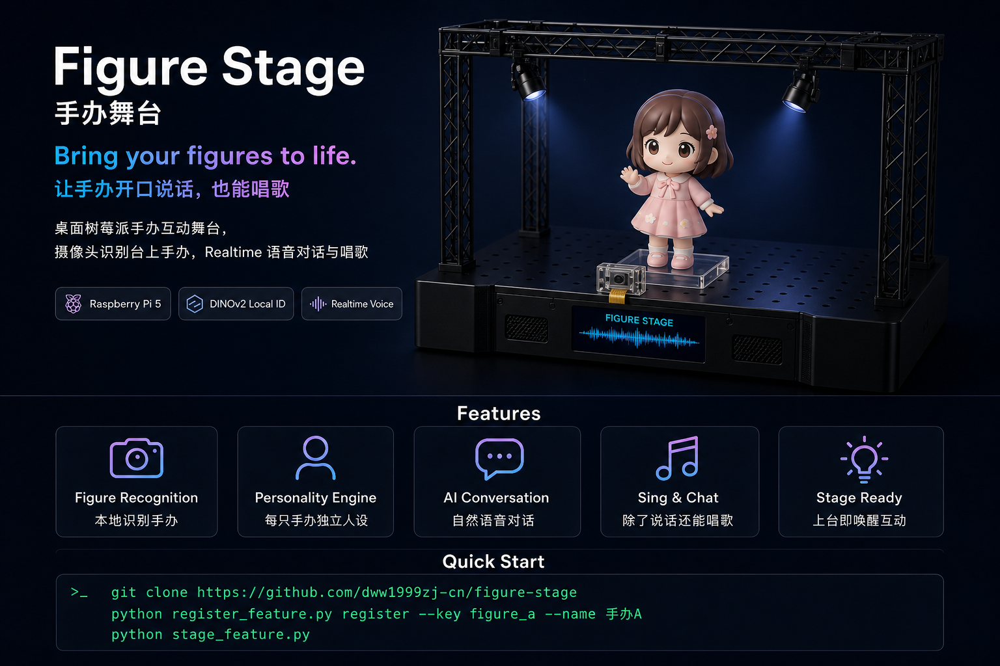
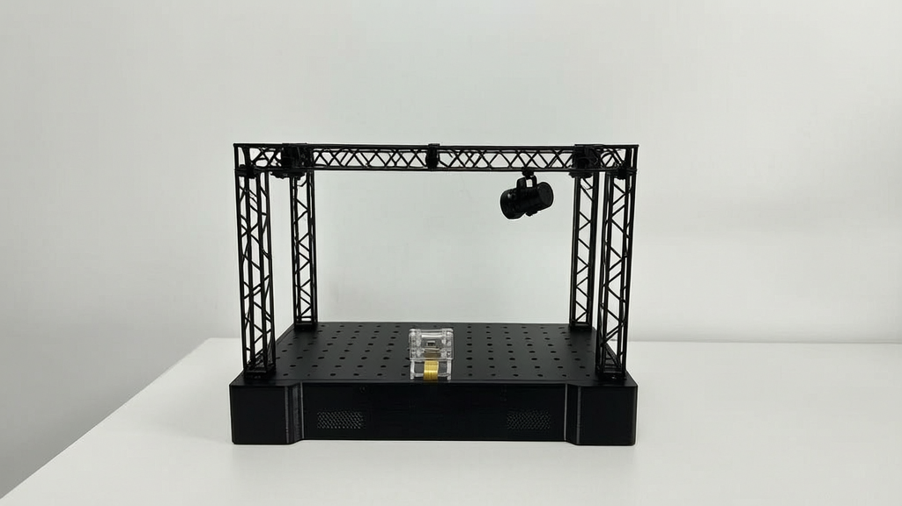
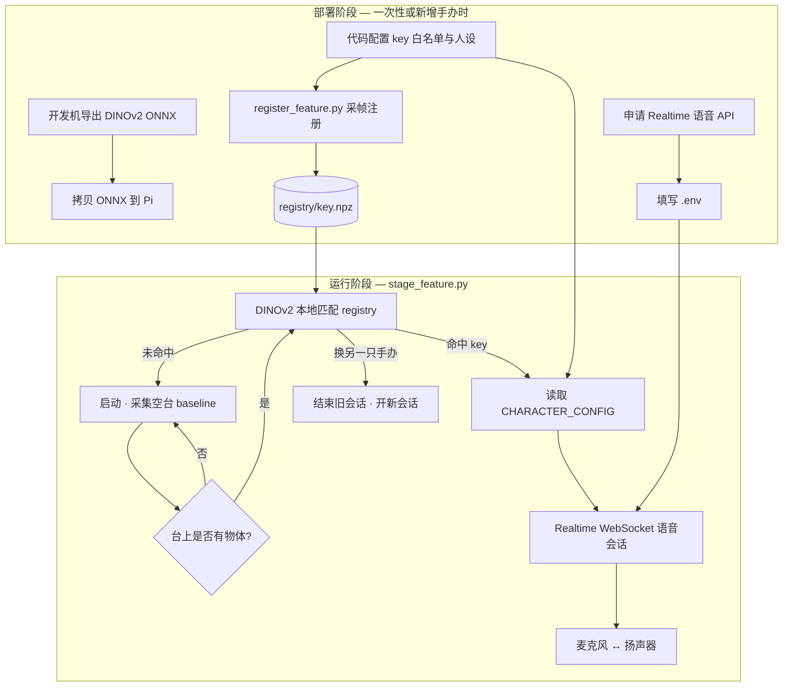

# 手办舞台 Figure Stage

树莓派 5 桌面手办互动：摄像头识别展示台上的手办，Realtime 语音对话与唱歌。

<p align="center">
  
</p>

---

## 这是什么？

「手办舞台」是一套跑在 **树莓派 5** 上的桌面互动装置：摄像头对准展示台，USB 麦克风与扬声器负责听和说。手办 **放上台** 后系统 **本地** 识别是哪一款；识别成功后开启 **Realtime 端到端语音**——能听、能说、可配置音色与人设，支持即兴对话与唱歌。

**一句话：把静态手办展示，升级成可对话、可唱歌的互动舞台。**

<p align="center">
  
</p>
<p align="center"><sub>实物展台：黑色桁架 + 顶部射灯 + 台前 Pi 摄像头（透明支架 + 排线）</sub></p>

---

## 项目逻辑总览

整个项目分 **两条线**：**视觉（本地）** 与 **语音（云端）**。识别不联网，只有开口说话才用 API。



| 阶段 | 做什么 | 主要文件 / 命令 | 需要网络 |
|------|--------|-----------------|----------|
| 准备模型 | 导出 DINOv2 ONNX | `scripts/export_dinov2_onnx.py` | 否（首次下载 torch hub 除外） |
| 准备账号 | 申请 Realtime 语音密钥 | `.env` 中 `DOUBAO_*` | 注册账号时需要 |
| 配置手办 | 定义允许哪些 key、语音人设 | `feature_embed.py`、`stage_feature.py` | 否 |
| 注册特征 | 为每只手办采集视觉特征 | `register_feature.py` | 否 |
| 上台互动 | 识别 + 对话 / 唱歌 | `stage_feature.py` | 仅语音段 |

---

## 硬件清单

| 组件 | 建议型号 | 用途 | 何时需要 |
|------|----------|------|----------|
| 主控 | 树莓派 5 | 运行识别与语音 | 运行 `stage_feature.py` |
| 摄像头 | IMX219（CSI，Picamera2） | 注册采帧 + 运行时识别 | 注册与运行 |
| 展示台 | 自建桁架小舞台 | 固定机位、放置手办 | 运行 |
| 麦克风 | USB 免驱麦克风 | 语音输入 | 运行 |
| 扬声器 | USB 或 3.5mm 音箱 | 语音 / 唱歌输出 | 运行 |
| 开发机 | 任意 PC（可选） | 导出 ONNX；无 Pi 摄像头时可用图片目录注册 | 仅准备阶段 |

**说明：**

- **只做注册 / verify**：Pi 或带摄像头的开发机即可，可不接 USB 音频。
- **完整对话**：Pi 上必须接麦克风与扬声器，并在 `.env` 中设置 `AUDIO_DEVICE_ID`。
- ONNX 模型文件较大，在开发机导出后 **拷贝到 Pi**（路径由 `FEATURE_MODEL_PATH` 指定，默认如 `~/Desktop/dinov2_vits14.onnx`）。

查看 USB 声卡编号：

```bash
python -c "import sounddevice; print(sounddevice.query_devices())"
```

---

## 完整部署步骤

按顺序完成以下步骤即可从零跑通。

### 步骤 1：获取代码与 Python 环境

```bash
git clone https://github.com/dww1999zj-cn/figure-stage.git
cd figure-stage
python3 -m venv .venv
source .venv/bin/activate   # Windows: .venv\Scripts\activate
pip install -r requirements.txt
```

### 步骤 2：导出 DINOv2 模型（开发机，仅需一次）

在 **开发机** 安装 PyTorch 并导出 ONNX（Pi 上不必装 torch）：

```bash
pip install torch
python scripts/export_dinov2_onnx.py
# 生成 models/dinov2_vits14.onnx
```

将 `dinov2_vits14.onnx` 拷贝到树莓派，例如 `~/Desktop/dinov2_vits14.onnx`。

### 步骤 3：申请 Realtime 语音 API（要用对话时必做）

| 环节 | 是否需要 API |
|------|--------------|
| `register_feature.py` 注册 / verify | **否** |
| `stage_feature.py` 视觉识别 | **否** |
| `stage_feature.py` 语音对话 / 唱歌 | **是** |

1. 在 [火山引擎](https://www.volcengine.com/) 注册并完成实名认证。
2. 打开 [语音技术 · 应用管理](https://console.volcengine.com/speech/app)，创建应用。
3. 开通 **端到端实时语音 / Realtime 对话**（WebSocket，非火山方舟 HTTP API）。  
   文档：[端到端实时语音大模型 API](https://www.volcengine.com/docs/6561/1801940)
4. 复制 `.env` 并填入控制台提供的三项：

```bash
cp .env.example .env
```

| `.env` 变量 | 含义 |
|-------------|------|
| `DOUBAO_APP_ID` | 应用 App ID |
| `DOUBAO_ACCESS_KEY` | Access Key / Token |
| `DOUBAO_APP_KEY` | App Key（**以控制台为准**） |

可选：`DOUBAO_WS_URL`、`DOUBAO_RESOURCE_ID`、`DOUBAO_MODEL` 一般保持默认。语音服务 **按量计费**，请在控制台关注额度与账单。

**密钥安全：** 只保存在本地 `.env`，勿提交 git；泄露请在控制台轮换。

### 步骤 4：配置环境变量

编辑 `.env`（模板见 [.env.example](.env.example)）：

| 类别 | 关键变量 | 说明 |
|------|----------|------|
| 语音 | `DOUBAO_APP_ID` 等 | 步骤 3 获取；不对话可暂不填 |
| 模型 | `FEATURE_MODEL_PATH` | Pi 上 ONNX 文件路径 |
| 特征库 | `FEATURE_REGISTRY_DIR` | 默认 `registry/` |
| 识别阈值 | `FEATURE_MIN_SCORE`、`FEATURE_MIN_MARGIN` | 多只手办易混时可调高 |
| 音频 | `AUDIO_DEVICE_ID` | USB 声卡编号 |

### 步骤 5：配置可用手办（代码白名单 + 人设）

**能注册哪些 key** 由代码白名单决定，**不是**自动扫描 `registry/` 目录。

| 文件 | 变量 | 作用 |
|------|------|------|
| `feature_embed.py` | `VALID_TARGET_KEYS` | **注册权威**：`register` 只接受此列表中的 key |
| `stage_feature.py` | `VALID_TARGET_KEYS` | 运行时过滤识别结果 |
| `stage_feature.py` | `CHARACTER_CONFIG` | 每个 key 的 name、prompt、speaker、speaking_style |

新增 key 时须 **三处同步**（详见 [扩展：新增一只手办](#扩展新增一只手办)）。  
仓库自带若干 key，可直接用于注册；无需改代码即可先体验。

### 步骤 6：注册手办特征

对 **每一款** 要识别的手办执行注册（机位、光线与日后运行尽量一致）：

```bash
# Pi 摄像头采帧（默认 24 帧）
python register_feature.py register --key wdog --name 手办A
python register_feature.py register --key ydog --name 手办B

python register_feature.py list
python register_feature.py verify --key wdog
```

开发机无摄像头时，从图片目录注册：

```bash
python register_feature.py register --key wdog --name 手办A --image-dir ./captures/figure_a
```

产出文件：

```
registry/
├── manifest.json      # 元数据：key、显示名、注册时间
├── wdog.npz           # 该 key 的多帧 embedding + 质心
└── ydog.npz
```

### 步骤 7：运行主程序

```bash
python stage_feature.py
```

1. 启动后 **约 3 秒内展示台保持空台**（采集 background baseline）。
2. 手办放上台 → 本地检测「有物体」→ DINOv2 与 `registry/` 匹配。
3. 命中某 key → 按 `CHARACTER_CONFIG` 开启 Realtime 语音会话。
4. 对话中或结束后 **换另一只手办** → 可结束旧会话并开启新会话。

---

## 注册逻辑说明

### 注册时发生了什么？

```
register --key wdog --name 手办A
        │
        ▼
检查 key ∈ VALID_TARGET_KEYS（feature_embed.py）
        │
        ▼
摄像头采 N 帧（或从 --image-dir 读图）
        │
        ▼
DINOv2 ONNX 逐帧提取 embedding → 求质心
        │
        ▼
写入 registry/wdog.npz + 更新 manifest.json
```

- **注册不需要** `DOUBAO_*`，全程本地。
- `verify` 命令：用当前画面（或 `--image`）与 registry 做 **一次** 相似度测试，不启动语音。

### 代码配置 vs 磁盘数据

| 概念 | 存在哪里 | 含义 |
|------|----------|------|
| 允许哪些 key | `VALID_TARGET_KEYS` | 代码白名单 |
| 某 key 的视觉特征 | `registry/{key}.npz` | 是否已注册 |
| 某 key 的语音人设 | `CHARACTER_CONFIG` | 能否对话 |

常见情况：

| 状态 | 结果 |
|------|------|
| key 不在白名单 | `register` 拒绝 |
| 白名单有 key，但未 register | 运行时永远匹配不到 |
| 已 register，但无 `CHARACTER_CONFIG` | 可能识别成功，开语音时 **KeyError** |
| 三者齐全 | 正常识别并对话 |

### register_feature.py 命令

| 命令 | 说明 |
|------|------|
| `register --key wdog --name 手办A` | 摄像头采帧注册 |
| `register --key wdog --name 手办A --image-dir ./captures/figure_a` | 从目录读图注册 |
| `list` | 列出已注册条目 |
| `delete --key wdog` | 删除某 key 的 npz 与 manifest 项 |
| `verify --key wdog` | 单次匹配验证 |

---

## 运行逻辑说明（stage_feature.py）

### 启动时

1. 加载 `.env`（检查 `DOUBAO_*`，缺则退出）。
2. 加载 DINOv2 ONNX 与 `registry/` 中所有已注册质心。
3. 打开 Picamera2，**采集空台 baseline**（默认约 30 帧，启动后数秒内勿放手办）。

### 主循环（简化）

```
每帧画面
  → 计算与 baseline 的灰度差（轻量「是否有物体上台」）
  → 若稳定检测到物体：
       DINOv2 提取当前 embedding
       与 registry 各 key 比余弦相似度 + top1/top2 margin
       超过 FEATURE_MIN_SCORE / FEATURE_MIN_MARGIN → 得到 target_key
  → 若 target_key 有效且未在对话：
       读取 CHARACTER_CONFIG[target_key]
       建立 Realtime WebSocket（ASR + 对话 + TTS）
       麦克风 48kHz → 重采样 16kHz 上行；TTS 24kHz 下行 → 扬声器
  → 若对话中画面识别到另一只手办：
       触发换会话（switch）
```

| 项目 | 说明 |
|------|------|
| 特征模型 | DINOv2 ViT-S/14（`FEATURE_MODEL_PATH`） |
| 匹配方式 | 余弦相似度 + top1 与 top2 的 margin |
| 上台检测 | 相对空台 baseline 的灰度差 + 稳定帧数 |
| 网络 | **识别纯本地**；**语音走 Realtime WebSocket** |

### 可选：联网搜索

`.env` 中 `DOUBAO_ENABLE_WEBSEARCH=true` 时可启用（需额外 API Key / Bot ID）。默认关闭，不影响基本对话。

---

## 扩展：新增一只手办

1. `feature_embed.py` → `VALID_TARGET_KEYS` 添加 `"figure_c"`
2. `stage_feature.py` → `VALID_TARGET_KEYS` 添加 **同一** `"figure_c"`
3. `stage_feature.py` → `CHARACTER_CONFIG` 添加 `figure_c` 的 prompt、speaker、speaking_style
4. 注册并验证：

```bash
python register_feature.py register --key figure_c --name 手办C
python register_feature.py verify --key figure_c
python stage_feature.py
```

---

## 配置速查

| 配置位置 | 内容 |
|----------|------|
| `.env` | API 密钥、模型路径、registry 目录、阈值、音频设备 |
| `feature_embed.py` | 可注册 key 白名单 |
| `stage_feature.py` | 可识别 key 白名单 + 语音人设 |
| `doubao_dialog.py` | Realtime dialog 与可选联网参数 |

环境变量完整列表见 [.env.example](.env.example)。

---

## 项目结构

```
figure-stage/
├── assets/
│   ├── figure-stage-promo.png
│   └── stage-empty.png
├── stage_feature.py            # 主程序：上台检测 + 匹配 + 语音
├── register_feature.py         # 注册 CLI
├── feature_embed.py            # DINOv2 + registry 公共逻辑
├── doubao_dialog.py            # Realtime dialog 构建
├── scripts/
│   └── export_dinov2_onnx.py   # 开发机导出 ONNX
├── requirements.txt
├── .env.example
├── models/dinov2_vits14.onnx   # 导出后拷贝，不进 git
└── registry/                   # 注册结果，不进 git
```

---

## 许可与商用

| 文档 | 说明 |
|------|------|
| [LICENSE](LICENSE) | **非商业使用免费**；修改与 fork 须保留许可与版权声明 |
| [COMMERCIAL.md](COMMERCIAL.md) | **商业使用** 须事先邮件联系 **dww1999zj@gmail.com** 取得书面许可 |
| [TRADEMARK.md](TRADEMARK.md) | 「手办舞台 / Figure Stage」名称不随代码许可转让 |

许可人：**dww1999zj-cn**
